# E-Commerce Analytics Pipeline

Bu repo, 6 aylık e-ticaret CSV verisi için temel bir ELT hattı uygular.

## Proje Yapısı
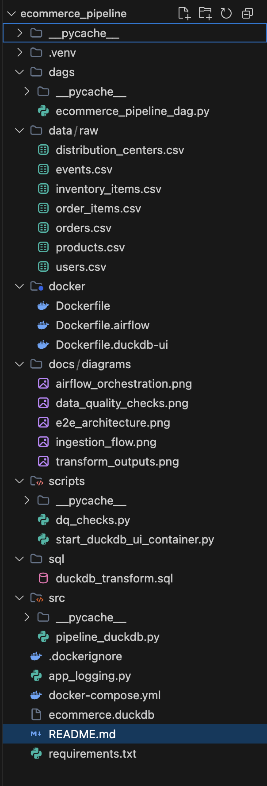
```text
ecommerce_pipeline/
  data/raw/                        # Girdi CSV dosyaları (lokalde tutulur, git'e dahil edilmez)
  src/
    pipeline_duckdb.py             # Ana ELT hattı (DuckDB)
  sql/
    transform/
      dims.sql                     # Dimension dönüşümleri
      facts.sql                    # Fact dönüşümleri
      views.sql                    # BI view dönüşümleri
  scripts/
    dq_checks.py                   # Veri kalite kontrolleri
    start_duckdb_ui_container.py   # Opsiyonel DuckDB local UI başlatma
  dags/
    ecommerce_pipeline_dag.py      # Airflow DAG (otomasyon)
  docker/
    Dockerfile
    Dockerfile.airflow
    Dockerfile.duckdb-ui
  docker-compose.yml
  app_logging.py                   # Yapılandırılmış JSON loglama
```

## Veri Alımı ve Modelleme

### Veri Alımı
- Ham CSV dosyaları `staging.*_raw` tablolara yüklenir.
- Yükleme işlemi `src/pipeline_duckdb.py` ile yapılır.
- Şema çıkarımı DuckDB `read_csv_auto(...)` ile yapılır.

### Diyagram 1: Ingestion Akışı
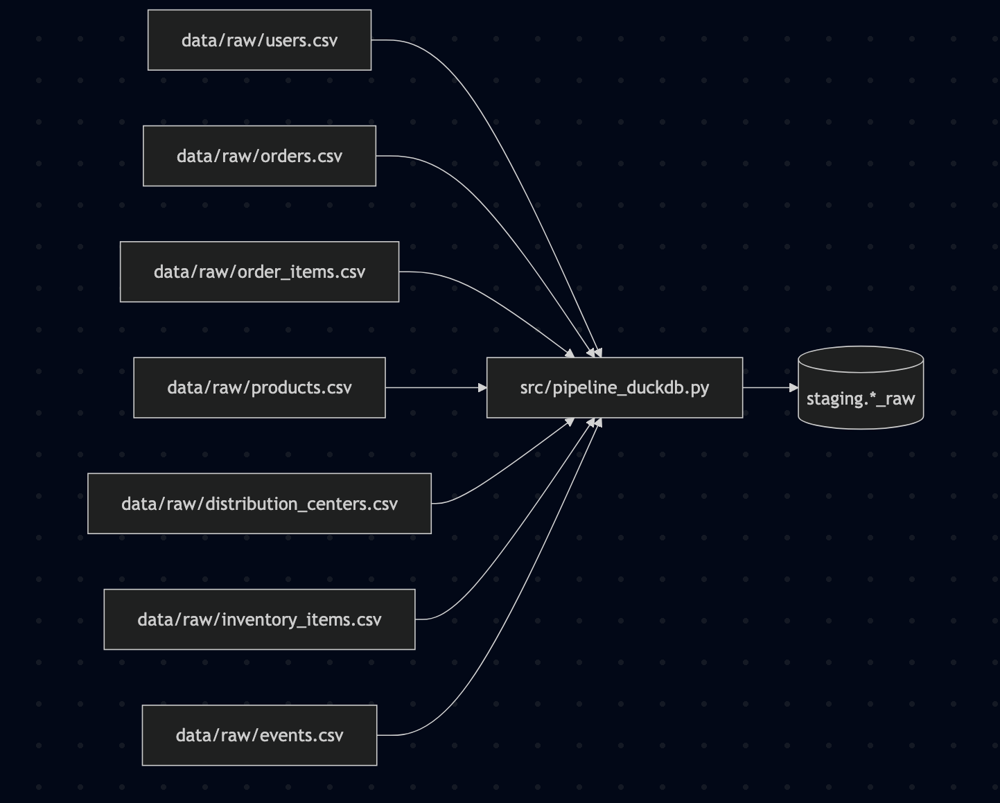
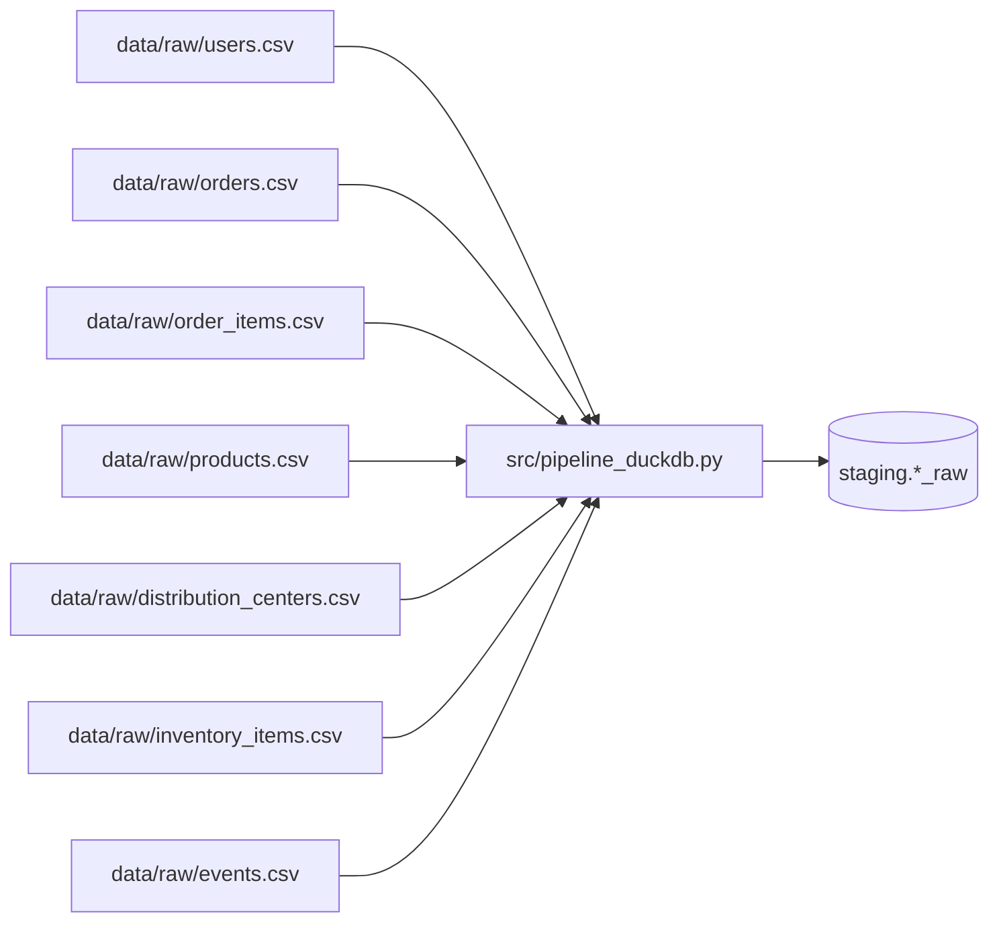

### Raw Katman ER Diyagramı (staging)
```text
Table users_raw {
  id text
  first_name text
  last_name text
  email text
  age text
  gender text
  state text
  street_address text
  postal_code text
  city text
  country text
  latitude text
  longitude text
  traffic_source text
  created_at text
}

Table orders_raw {
  order_id text
  user_id text
  status text
  gender text
  created_at text
  returned_at text
  shipped_at text
  delivered_at text
  num_of_item text
}

Table order_items_raw {
  id text
  order_id text
  user_id text
  product_id text
  inventory_item_id text
  status text
  created_at text
  shipped_at text
  delivered_at text
  returned_at text
  sale_price text
}

Table products_raw {
  id text
  cost text
  category text
  name text
  brand text
  retail_price text
  department text
  sku text
  distribution_center_id text
}

Table distribution_centers_raw {
  id text
  name text
  latitude text
  longitude text
}

Table inventory_items_raw {
  id text
  product_id text
  created_at text
  sold_at text
  cost text
  product_category text
  product_name text
  product_brand text
  product_retail_price text
  product_department text
  product_sku text
  product_distribution_center_id text
}

Table events_raw {
  id text
  user_id text
  sequence_number text
  session_id text
  created_at text
  ip_address text
  city text
  state text
  postal_code text
  browser text
  traffic_source text
  uri text
  event_type text
}

Ref: orders_raw.user_id > users_raw.id
Ref: order_items_raw.order_id > orders_raw.order_id
Ref: order_items_raw.user_id > users_raw.id
Ref: order_items_raw.product_id > products_raw.id
Ref: products_raw.distribution_center_id > distribution_centers_raw.id
Ref: inventory_items_raw.product_id > products_raw.id
Ref: events_raw.user_id > users_raw.id
```

### Hedef Model
Mart katmanı fact/dimension prensibiyle tasarlanmıştır:
- Fact tablolar: `mart.fact_orders`, `mart.fact_order_items`
- Dimension tablolar: `mart.dim_users`, `mart.dim_products`, `mart.dim_distribution_centers`

Not: Bu yapı star benzeri analitik modeldir (teknik olarak iki fact tablo ve `product -> distribution_center` bağı nedeniyle küçük bir fact constellation yapısıdır).

### ER Tanımı (dbdiagram)
```text
Table fact_order_items {
  order_item_id bigint [pk]
  order_id bigint
  user_id bigint
  product_id bigint
  item_status text
  created_at_utc timestamp
  sale_price double
  quantity bigint
  line_revenue double
}

Table fact_orders {
  order_id bigint [pk]
  user_id bigint
  order_status text
  created_at_utc timestamp
  order_date date
  num_of_item bigint
}

Table dim_users {
  user_id bigint [pk]
  first_name text
  last_name text
  email text
  gender text
  city text
  state text
  country text
  created_at_utc timestamp
}

Table dim_products {
  product_id bigint [pk]
  product_name text
  category text
  brand text
  department text
  retail_price double
  cost double
  distribution_center_id bigint
}

Table dim_distribution_centers {
  distribution_center_id bigint [pk]
  center_name text
  latitude double
  longitude double
}

Ref: fact_order_items.order_id > fact_orders.order_id
Ref: fact_order_items.user_id > dim_users.user_id
Ref: fact_order_items.product_id > dim_products.product_id
Ref: fact_orders.user_id > dim_users.user_id
Ref: dim_products.distribution_center_id > dim_distribution_centers.distribution_center_id
```

### Diyagram 2: Mart Modeli (Fact/Dim)
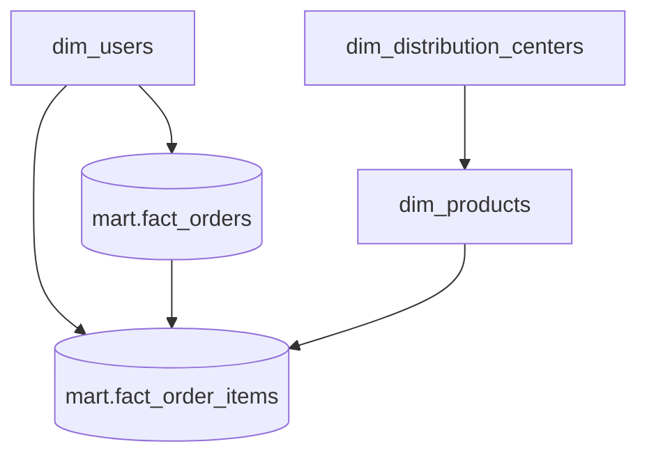

## Veri Dönüşümü (ELT)

Dönüşüm mantığı `sql/transform/*.sql` dosyalarındadır (`dims.sql`, `facts.sql`, `views.sql`):
- Tekilleştirme: `ROW_NUMBER() ... WHERE rn = 1`
- Null/boş değer yönetimi: `COALESCE(NULLIF(TRIM(...), ''), ...)`
- Tip dönüşümleri: `BIGINT`, `DOUBLE`, `TIMESTAMP`, `DATE`
- Durum normalizasyonu: `LOWER(...)`

BI için hazır çıktılar:
- `mart.daily_commerce_metrics` (kategori bazlı günlük performans: satılan adet, kategori cirosu + günlük toplam metrikler)
- `mart.daily_summary_metrics` (günlük toplam ciro ve sipariş hacmi)
- `mart.daily_top_category` (gün bazında en çok gelir üreten kategori)

### Diyagram 3: Transform Çıktıları
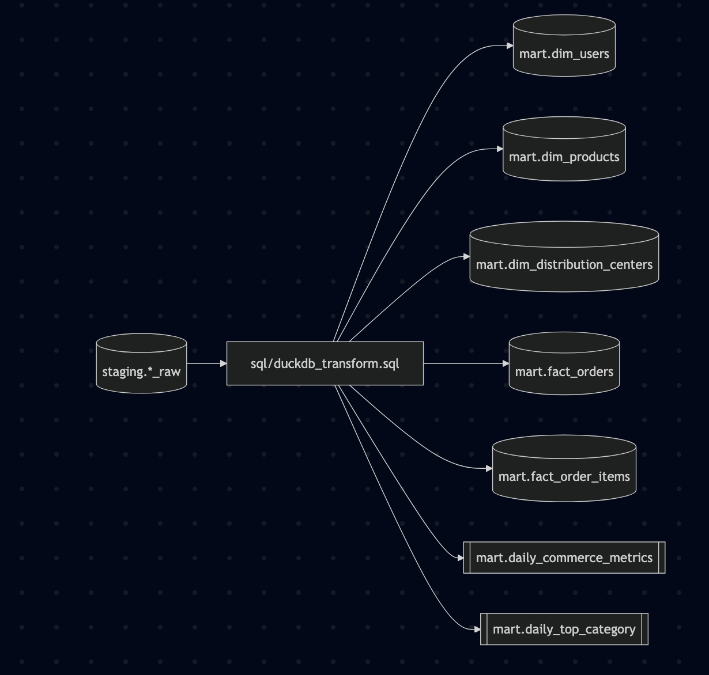
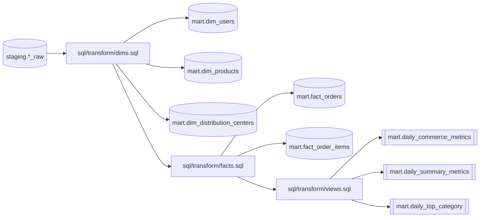

## Pipeline Otomasyonu

### Tekrarlanabilir Pipeline
- Pipeline idempotent tasarlanmıştır (`CREATE OR REPLACE` yaklaşımı).
- Tekrar çalıştırıldığında mart tabloları/view’ları ham veriden deterministik şekilde yeniden üretilir.

### Airflow Orkestrasyonu (Bonus)
DAG: `ecommerce_elt_pipeline`
1. `validate_inputs`
2. `load_users`
3. `load_orders`
4. `load_order_items`
5. `load_products`
6. `load_distribution_centers`
7. `load_inventory_items`
8. `load_events`
9. `transform_dims`
10. `transform_facts`
11. `transform_views`
12. `run_dq_checks`

Ek operasyonel kontroller:
- **Granüler Görev İzolasyonu:** Hata yönetimi (Retry) sırasında baştan başlamak yerine sadece hata alan adım (örneğin sadece Transform) tekrarlanarak gigabaytlarca I/O (CSV okuma) israfı önlenir.
- **Otomatik Retry Mekanizması:** Olası kilitlenmelere (File Lock) karşı her adım 2 dakika arayla 3 defa otomatik olarak tekrar denenir.
- Yapılandırılmış JSON loglar
- Pipeline sonrasında veri kalite kontrolü

### Diyagram 4: Airflow Orkestrasyon Akışı
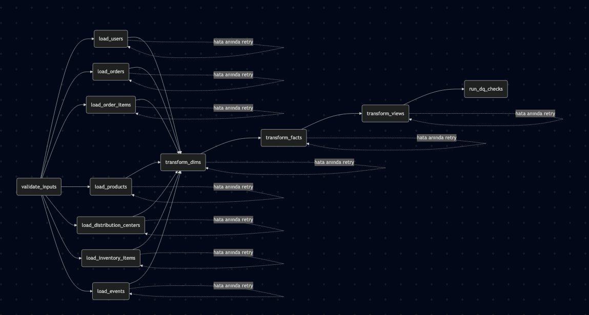
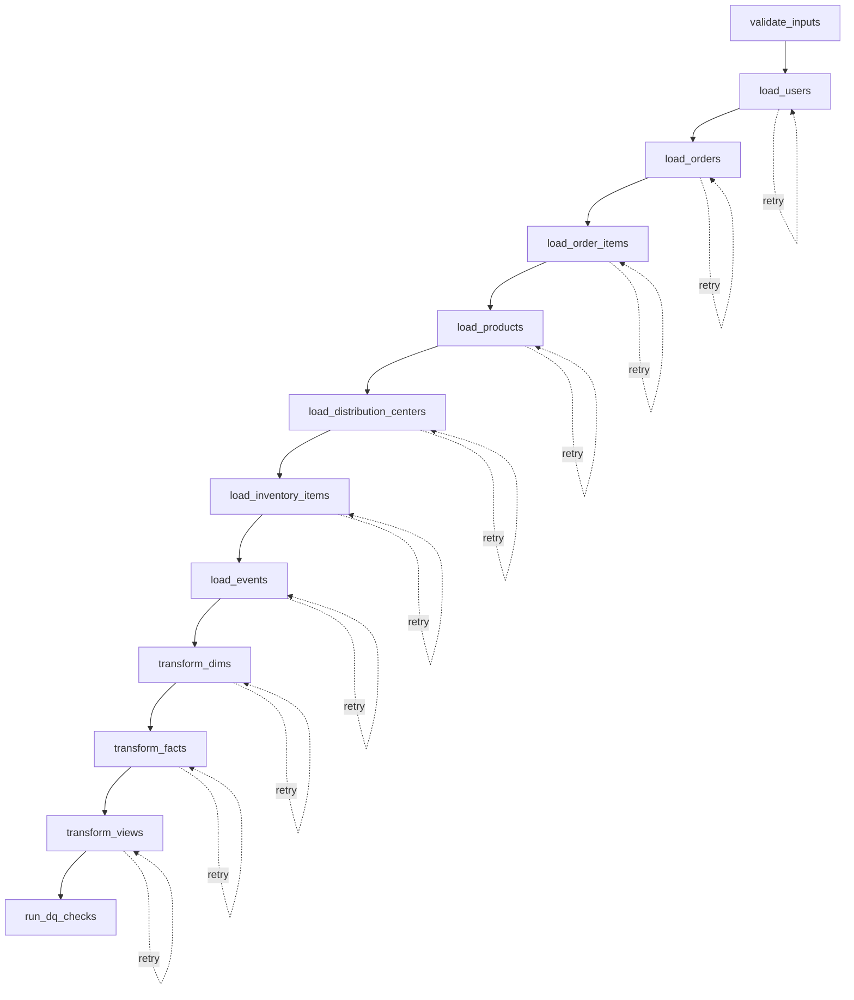

### Lokalde Çalıştırma

#### 1. Proje dizinine gir
```bash
cd ecommerce_pipeline
```

#### 2. Pipeline'ı çalıştır (DuckDB build container)
```bash
docker compose --profile tools run --rm duckdb-build
```
Not: `pipeline_duckdb.py` içinde `--step transform`, `transform_dims -> transform_facts -> transform_views` zinciri için alias olarak çalışır.

#### 3. (Opsiyonel) Airflow stack'i ayağa kaldır
```bash
docker compose down --remove-orphans
docker compose up --build
```
Airflow UI:
- `http://localhost:8080`
- kullanıcı/şifre: `admin/admin`

#### 4. (Opsiyonel) DuckDB UI aç
Önce container tabanlı UI:
```bash
docker compose --profile duckui up --build duckdb-ui
```
UI: `http://localhost:4213`

Container yerine local `duckdb` Python paketiyle açmak istersen:
```bash
docker compose stop duckdb-ui || true
source .venv/bin/activate
python - << 'PY'
import duckdb, time
con = duckdb.connect("ecommerce.duckdb")
con.execute("INSTALL ui; LOAD ui;")
print(con.execute("CALL start_ui_server();").fetchall())
time.sleep(99999)
PY
```
Beklenen çıktı:
`[('UI server started at http://localhost:4213/',)]`

### Beklenen Çıktı (Referans)
- `mart.dim_users`: `100000`
- `mart.dim_products`: `29120`
- `mart.dim_distribution_centers`: `10`
- `mart.fact_orders`: `50291`
- `mart.fact_order_items`: `73110`

## Mimari Tercihler
- DuckDB, local-first analitik kurulum kolaylığı için seçildi.
- SQL-first dönüşüm yaklaşımı iş kurallarını şeffaf ve gözden geçirilebilir tutar.
- Fact/dimension model BI sorgularını hızlandırır ve sadeleştirir.
- Airflow, otomasyon bonusu kapsamında eklendi.

## Veri Kalitesi Stratejisi
Uygulanan kontroller:
- Dönüşüm öncesi input dosya varlık kontrolü
- İş anahtarına göre tekilleştirme
- Null/default yönetimi
- Veri tipi normalizasyonu
- Dönüşüm sonrası DQ kontrolleri (`scripts/dq_checks.py`)

### Diyagram 5: Veri Kalite Kontrolü
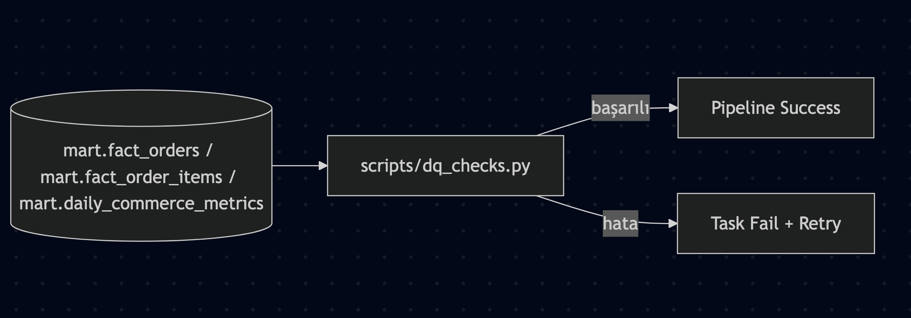
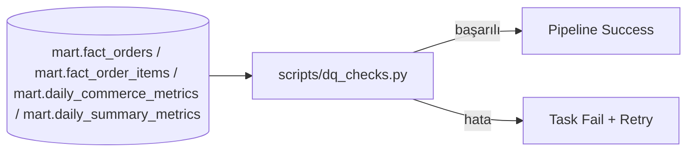

## Loglama
`app_logging.py` üzerinden yapılandırılmış JSON loglama kullanılır.
- Ortam değişkeni: `LOG_LEVEL` (`DEBUG`, `INFO`, `WARNING`, `ERROR`)
- Varsayılan: `INFO`

Örnek:
```bash
LOG_LEVEL=DEBUG docker compose up --build
```

## 100x Veri Büyümesinde Nasıl Evrilir?
100x ölçek için önerilen değişiklikler:
1. Local dosya yerine object storage kullanımı (GCS/S3).
2. CSV yerine partitioned Parquet formatı.
3. Full refresh yerine incremental load (watermark/CDC).
4. Eşzamanlı BI yükleri için managed warehouse (BigQuery/Snowflake/Redshift).
5. Metadata-driven orchestration, schema evolution ve data contract yönetimi.
6. Monitoring/alerting (SLA, freshness, row count drift, failure alert).
7. Dev/stage/prod ayrımı, CI/CD ve otomatik veri testleri.

### Diyagram 6: Uçtan Uca Mimari
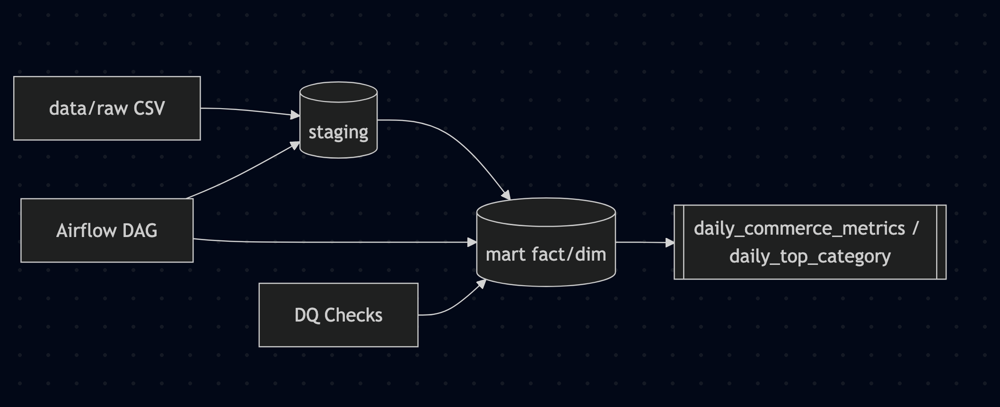
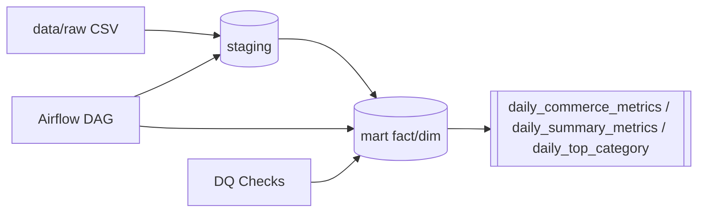
